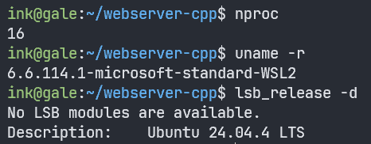
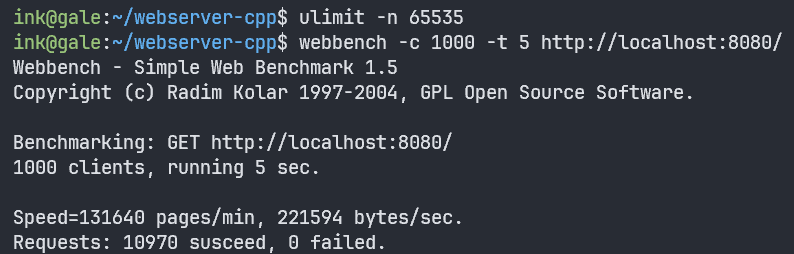
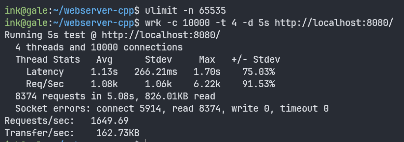

# GaleWebServer

Linux 下的轻量级 C++ Web 服务器。

1. **并发模型**: 使用 **线程池 + 非阻塞socket + epoll(ET和LT均实现) + 模拟Proactor事件处理** 的并发模型
2. **HTTP**: 使用 **有限状态机** 解析HTTP请求报文，支持解析 **GET** 请求，可以请求服务器 **静态文件**
3. **日志系统**: 实现 **同步/异步日志系统** ，记录服务器运行状态和错误信息
4. **定时器**: 采用双向链表维护每个连接的可活动时长，**epoll_wait 超时驱动，O(1) 调整**
5. **压力测试**: 经过Webbench压力测试可以实现 **3000QPS 的吞吐量**

## 项目结构

```
webserver-cpp/
├── main.cpp                # 入口
├── webserver.cpp           # 服务器主逻辑（eventLoop + accept）
├── http_conn.cpp           # HTTP 状态机 + 静态文件 + 响应
├── epoller.cpp             # epoll 封装（wait / add / mod / del）
├── timer.cpp               # 定时器（升序双向链表 + tick）
├── log.cpp                 # 日志系统（同步/异步 + 环形队列）
├── cmdline.cpp             # 命令行解析
│ 
├── include/
│   ├── webserver.h
│   ├── threadpool.h        # 线程池模板（pthread + 条件变量）
│   ├── http_conn.h
│   ├── epoller.h
│   ├── timer.h
│   ├── locker.h            # RAII 锁封装（locker / cond / sem / scope_lock）
│   ├── log.h
│   └── cmdline.h
├── Makefile
├── index.html              # 测试页面
├── test.jpg                # 测试图片
└── PROJECT_GUIDE.md        # 完整开发指南
```

## 架构

```
main()
  ├── Cmdline:              命令行参数（端口、epoll模式、日志模式）
  └── WebServer:
        ├── Epoller:        epoll 实例，监控所有 fd，ET/LT可选择
        ├── threadpool:     8 个工作线程（模拟 Proactor）
        ├── HttpConn[]:     预分配数组，下标 = fd
        ├── TimerList:      双向链表，管理连接超时
        ├── Log:            单例，同步/异步可选择
        └── eventLoop():
              epoll_wait            返回就绪 fd
              → accept / read_once （模拟Proactor，主线程代理 I/O）
              → pool.append        （交给工作线程）
              → process()           解析 HTTP + 返回响应
```

## 性能

测试环境: 

* 总参数：线程池线程个数8个，最多同时打开65535个文件描述符，命令为:
```bash
$ ulimit -n 65535
$ ./server -p 8080 -l 1
```
* 测试工具：
      * Webbench 1.5：并发数1000，持续时间5s，命令为:`webbench -c 1000 -t 5 http://localhost:8080/`
      * wrk：并发数10000，线程数4个，持续时间5s，命令为:`wrk -c 10000 -t 4 -d 5s http://localhost:8080/`
* 测试机器：
      * WSL2 on Windows 11
      * Ubuntu 24.04 (Linux 6.8)`用lsb_release -d`

> * WSL2参数



> * 裸 Linux 参数

??????

* 测试结果：

> * WSL2 + 小文件 + Webbench

> * WSL2 + 小文件 + wrk

> * 裸 Linux + 小文件 + Webbench

> * 裸 Linux + 小文件 + wrk

* 测试结论：

在小文件传输的情况下，在WSL2上webbench-qps-2000，wrk-pqs-1600；在裸Linux上？？？

## 构建 & 运行

```bash
# 编译
make

# 运行（同步日志）
./server -p 8080 -l 0

# 运行（异步日志，高并发推荐）
./server -p 8080 -l 1

# 关闭日志
./server -p 8080 -c 1
```

浏览器访问 `http://localhost:8080/`，看到页面即启动成功。


## 核心设计

### 模拟 Proactor

主线程代理所有 I/O，工作线程只处理已读好的数据。

| 模式 | I/O 谁做 | 工作线程拿到什么 |
|------|---------|----------------|
| Reactor | 工作线程自己 `recv` | 裸 fd |
| 真 Proactor | 内核异步 `aio_read` | 已读好的数据 |
| **本项目** | **主线程同步 `recv`** | **已读好的数据** |

Linux 的异步 I/O 对 socket 支持很差，用主线程同步 I/O 模拟异步——工作线程拿到 `HttpConn` 时 `m_read_buf` 已有数据，直接解析即可。

### epoll + 非阻塞 I/O

| 概念 | 作用 |
|------|------|
| epoll | 一个系统调用同时监控所有连接的 I/O 事件，O(1) 获取就绪列表 |
| LT（水平触发） | 没读完下次还通知，编程简单 |
| ET（边缘触发） | 状态变化才通知一次，效率更高但必须配合非阻塞 + 循环读 |
| ONESHOT | 一次通知后自动移除，保证一个连接同时只被一个线程处理 |
| 非阻塞 socket | `recv`/`send` 无数据不卡线程，立即返回 EAGAIN |

### HTTP 状态机

```
PARSE_REQUESTLINE → PARSE_HEADER → PARSE_BODY → GET_REQUEST
```

TCP 是字节流，一次 `recv` 可能只收到半个请求。状态机按 `\r\n` 逐行取、分阶段解析，数据不全就返回 `NO_REQUEST` 等下一轮。

### 线程池

| 成员 | 说明 |
|------|------|
| 8 个常驻线程 | 复用不销毁，避免频繁创建开销 |
| 互斥锁 + 条件变量 | 保护任务队列，空闲时 `wait` 休眠不占 CPU |
| 优雅关闭 | `m_stop = true` → `broadcast` 全唤醒 → 各线程退出 |

### 定时器

升序双向链表。所有连接超时时长相同，最近活跃的在尾部，最久未活跃的在头部。新连接 O(1) 挂尾，活跃连接 O(1) 移到尾。用 `epoll_wait(timeout)` 驱动 tick，不用信号。

### 日志系统

单例 + 同步/异步可切换。Hansen/Mesa 管程语义：`wait` 原子释放锁并阻塞，`signal` 唤醒等待者——你在线程池和日志中都用到了。

```
同步: 业务线程 → fputs → fflush（每行刷盘，可靠但慢）
异步: 业务线程 → strdup → 环形队列 → signal → 返回（不等磁盘）
                  后台线程: wait 醒来 → 批量写盘 → free
```

## 技术文章

| 文章 | 内容 |
|------|------|
| [并发模型1：线程池 + 模拟Proactor](https://twj-ink.github.io/blogs/threadpool-proactor/) | 线程池解析、本项目为何模拟 Proactor |
| [并发模型2：epoll LT/ET 深入对比](https://twj-ink.github.io/blogs/epoll-lt-et/) | 触发机制、非阻塞的必要性、ONESHOT 与线程安全 |
| [HTTP 状态机详解](https://twj-ink.github.io/blogs/http-state-machine/) | TCP 字节流问题、主/从状态机、常见边界情况 |
| [C++ RAII 锁与现代同步原语](https://twj-ink.github.io/blogs/cpp-raii-lock/) | pthread 封装、条件变量 vs 信号量、PV 操作 |
| [双缓冲异步日志实现](https://twj-ink.github.io/blogs/async-log/) | 环形队列、strdup/free 配对、管程语义 |
| [Webbench 压力测试与性能调优](https://twj-ink.github.io/blogs/webbench-benchmark/) | 测试方法、系统参数调优、瓶颈分析 |
| [从零构建 C++ Web 服务器的经验与踩坑](https://twj-ink.github.io/blogs/webserver-from-scratch/) | 完整开发流程、常见 bug、GDB 调试实战 |

> 链接指向博客对应文章，陆续更新中。

## 压力测试

```bash
# 编译
make

# 启动（异步日志，减少 I/O 影响）
ulimit -n 65535
./server -p 8080 -l 1
```

另一终端：

```bash
# 安装 Webbench
wget http://home.tiscali.cz/~cz210552/distfiles/webbench-1.5.tar.gz
tar -xzf webbench-1.5.tar.gz && cd webbench-1.5
sed -i 's|<rpc/types.h>|<stdbool.h>|' webbench.c
make && sudo cp webbench /usr/local/bin/

# 测试
ulimit -n 65535
webbench -c 1000 -t 30 http://localhost:8080/
```

## 许可

MIT License
